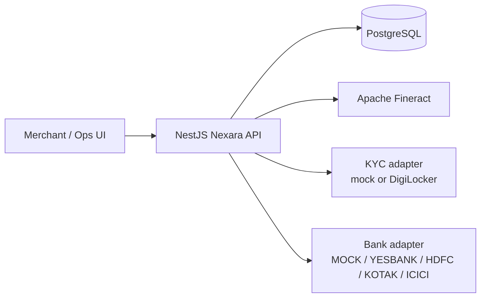
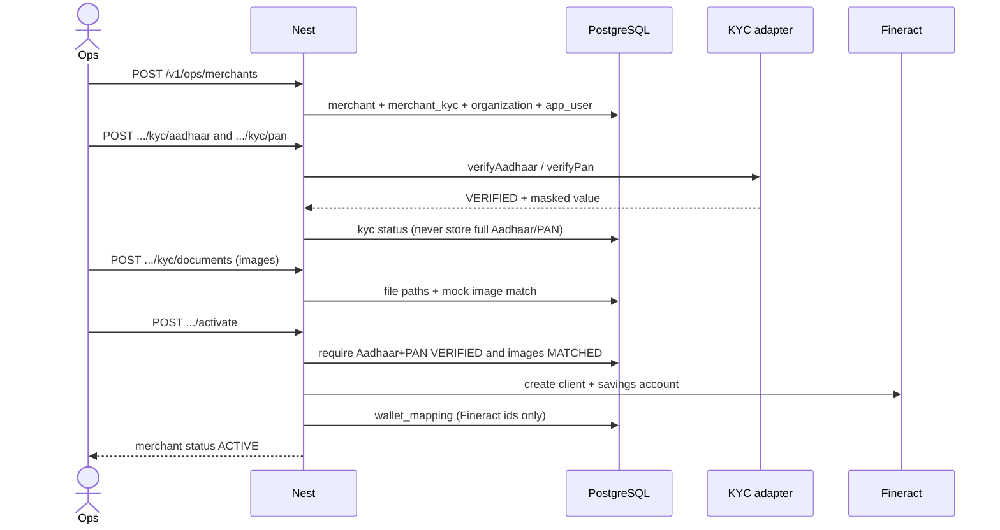
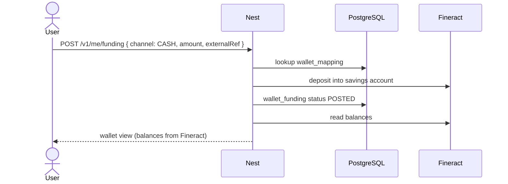
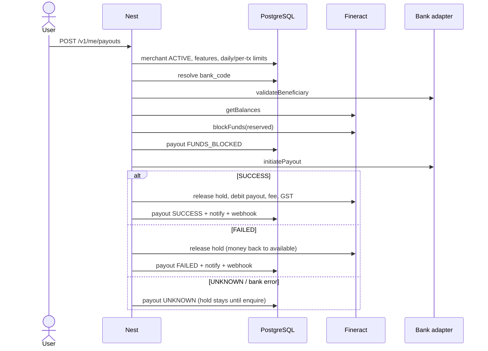
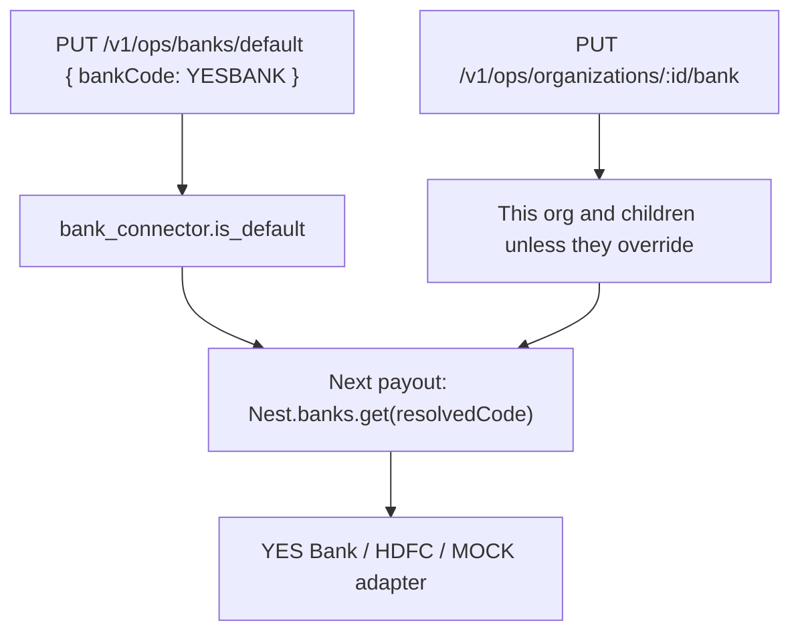

# Nexara — end-to-end guide

This document describes how the **Nexara API** works today: what NestJS owns, what Apache Fineract owns, how bank and KYC adapters plug in, the money flows, and how to call every route.

Interactive API explorer: [http://localhost:3000/docs](http://localhost:3000/docs) (Swagger). OpenAPI JSON: [http://localhost:3000/docs-json](http://localhost:3000/docs-json).

API base URL: `http://localhost:3000/v1`

---

## 1. What Nexara is

Nexara is a **payment orchestration layer** for a merchant wallet and payout product.

Merchants hold a wallet, add money, and send IMPS / NEFT / RTGS / UPI payouts. Super-distributors and distributors sit above merchants. Ops/admin configure banks, features, limits, KYC, and fees.

The NestJS app is the only public API. It talks to:

| System | Role |
|---|---|
| **PostgreSQL** | Nexara’s own records (who, what they may do, payout orders, KYC, auth) |
| **Apache Fineract** | The **financial ledger** (balances and every rupee movement) |
| **KYC adapter** | Aadhaar / PAN verify (mock now, DigiLocker later) |
| **Bank adapter** | Send money out (mock now, YES Bank / HDFC / Kotak / ICICI later) |

The frontend never talks to Fineract or the bank. It only talks to Nest.

---

## 2. Ownership: who stores what



### NestJS owns (orchestration)

- HTTP API, JWT auth, validation, error shape
- Hierarchy, feature flags, bank routing
- Merchant profile, KYC state, limits, fees, tier
- Payout **order** lifecycle and status history
- Funding **requests** (cash posted vs UPI/bank/card pending)
- Beneficiaries, notifications, webhooks, audit
- Mapping from `merchantId` → Fineract savings account id

### PostgreSQL stores (Nexara data)

| Table | Purpose |
|---|---|
| `app_user`, `otp_challenge` | Logins and OTP |
| `organization`, `organization_feature` | Hierarchy and allowed features |
| `bank_connector` | Enabled banks + platform default |
| `merchant`, `merchant_kyc` | Merchant + KYC (masked IDs, image paths) |
| `wallet_mapping` | Pointer to Fineract client + savings account |
| `wallet_funding` | Add-money requests |
| `payout`, `payout_status_event` | Payout orders and history |
| `beneficiary` | Saved payees |
| `notification`, `notification_read` | In-app inbox |
| `merchant_webhook`, `webhook_delivery` | Outbound webhooks |
| `audit_event` | Who changed what |

KYC **images** are files under `uploads/kyc/`. Postgres stores the path only.

### Fineract owns (money)

Fineract is treated as a black box. Nest never writes balances into Postgres as source of truth.

| Fineract object | Meaning in Nexara |
|---|---|
| Client | One merchant |
| Savings account (product **Nexara Merchant Wallet**, id `3` locally) | That merchant’s wallet |
| Deposit | Add money (cash funding) |
| Hold / block | Reserve payout + fee + GST |
| Release | Unblock on failed payout |
| Withdrawal + fee + GST charges | Successful payout settlement |
| Statement | Activity feed |

Balances returned by the API (`total`, `blocked`, `available`) always come from Fineract.

### KYC adapter owns

`verifyAadhaar` and `verifyPan` only. Nest stores the result (status, masked value, provider ref). DigiLocker is a stub until credentials exist. `KYC_PROVIDER=mock` is the local default.

### Bank adapter owns

`validateBeneficiary`, `initiatePayout`, `getPayoutStatus`. Nest chooses **which** bank from the database (platform default, or an org override). Merchant APIs do not name a bank.

---

## 3. Hierarchy, features, and banks

```
ADMIN
 └── SUPER_DISTRIBUTOR
      └── DISTRIBUTOR
           └── MERCHANT
```

Admin may attach a distributor or merchant directly. Super-distributors may attach distributors or merchants. Distributors may attach merchants only.

**Features** inherit from the parent unless the node has a custom allow-list. A child cannot receive a feature the parent does not have.

Catalog: `WALLET`, `STATEMENT`, `PAYOUT`, `PAYOUT_IMPS`, `PAYOUT_NEFT`, `PAYOUT_RTGS`, `PAYOUT_UPI`.

**Bank resolution** (first match wins):

1. This organization’s `bank_code` if set
2. Walk parents until someone has a bank
3. Platform default in `bank_connector` (`is_default = true`)

`BANK_PROVIDER` in `.env` only seeds the **first** default (`mock` → MOCK). After boot, change it with `PUT /v1/ops/banks/default`. Switching MOCK → YESBANK → HDFC does not change merchant payout APIs.

HDFC / Kotak / ICICI adapters exist but throw “not configured” until credentials are added. Enable the bank, then set it as default (or on an org) before sending live traffic.

---

## 4. How to run and call the API

```bash
docker compose up -d postgres
cp .env.example .env
npm install
npm run start:dev
```

Needs:

- Postgres on port **5434** (`nexara-postgres`)
- Fineract at `https://localhost:8443` (tenant `default`, user `nexara-api`)

### Auth

Every route except `/v1/health*`, `/v1/auth/*`, and `POST /v1/onboarding` needs:

```
Authorization: Bearer <accessToken>
```

Seeded staff:

| Email | Password | Role |
|---|---|---|
| `admin@nexara.com` | `NexaraAdmin#2026` | `ADMIN` |
| `ops@nexara.com` | `NexaraAdmin#2026` | `OPS` |

Merchant default password: `ChangeMe#2026`. Dev OTP is always `123456`.

```bash
curl -s http://localhost:3000/v1/auth/login \
  -H "Content-Type: application/json" \
  -d "{\"email\":\"admin@nexara.com\",\"password\":\"NexaraAdmin#2026\"}"
```

In Swagger: **Authorize** → paste the `accessToken`.

Roles:

| Role | Can call |
|---|---|
| `ADMIN`, `OPS` | All `/v1/ops/*` plus `GET /v1/me` and notifications |
| `MERCHANT` | `/v1/me/*` (wallet, payouts, beneficiaries, webhooks) |

Amounts are **strings** with two decimals: `"20000.00"`. Do not send JS numbers.

Error body (all failures):

```json
{ "code": "INSUFFICIENT_BALANCE", "message": "Available balance is insufficient", "requestId": "..." }
```

---

## 5. Core flows

### 5.1 Merchant onboarding → KYC → wallet



Activate requires:

- Aadhaar API `VERIFIED` and PAN API `VERIFIED`
- Aadhaar image match `MATCHED` and PAN image match `MATCHED`
- Ancestors `ACTIVE` and feature `WALLET` allowed

Mock KYC: Aadhaar `999999999999` and PAN `AAAAA9999A` fail. Image filename containing `mismatch` → `MISMATCH`.

Self-service: `POST /v1/onboarding` creates the merchant + user and returns a JWT. Ops still does KYC + activate.

### 5.2 Add money (cash)



`UPI` / `BANK_TRANSFER` / `CARD` write a **PENDING** `wallet_funding` row and return `409 FUNDING_CHANNEL_UNAVAILABLE`. They will credit Fineract only when a collection-account confirmation API exists.

Ops can also credit with `POST /v1/ops/wallets/:merchantId/credits` (same as cash) or `/funding`.

### 5.3 Payout

Reserved amount = payout + fee + GST. Example: amount `20000.00`, fixed fee `10.00`, GST 18% → reserved `20011.80`.



Payout states Nest stores: `INITIATED`, `FUNDS_BLOCKED`, `SUBMITTED_TO_BANK`, `SUCCESS`, `FAILED`, `UNKNOWN`.

If the bank is async (`UNKNOWN`), call `POST /v1/ops/payouts/:id/enquire`. Nest asks the **same** bank that took the payout, then settles Fineract.

Mock bank:

- Account ending in `0000` → `FAILED`
- IFSC starting with `UNKN` → `UNKNOWN`
- Otherwise → `SUCCESS`

Idempotency: same `merchantId` + `merchantReference` returns the existing payout.

### 5.4 Activity feed

`GET /v1/me/activity` (and ops wallet activity) maps the Fineract statement:

| Fineract line | Activity |
|---|---|
| CREDIT / RELEASE | CREDIT, COMPLETED |
| HOLD | DEBIT, PENDING |
| other DEBIT | DEBIT, COMPLETED |
| reversed | REVERSED |

There is one ledger. Do not keep a second “transactions” table in Nest.

### 5.5 Bank switch (no merchant API change)



---

## 6. Suggested first-use path

1. Login as admin → copy `accessToken`.
2. `GET /v1/health/ready` — postgres + fineract + default bank.
3. `GET /v1/ops/catalog` — features, banks, hierarchy rules.
4. `POST /v1/ops/organizations` — create a super-distributor (parent = admin org from catalog/network).
5. `POST /v1/ops/merchants` — create merchant under that org.
6. KYC Aadhaar + PAN + documents → `POST .../activate` (opens Fineract wallet).
7. `POST /v1/ops/wallets/:merchantId/funding` with `channel: CASH`.
8. Merchant login (email/password or OTP) → `POST /v1/me/payouts`.
9. `GET /v1/me/activity` and `GET /v1/ops/payouts`.

---

## 7. API catalog

Public (no JWT):

| Method | Path | Purpose |
|---|---|---|
| GET | `/v1/health` | Process up |
| GET | `/v1/health/ready` | Postgres + Fineract + default bank |
| POST | `/v1/auth/login` | `{ email, password }` → JWT |
| POST | `/v1/auth/otp/request` | `{ mobile }` |
| POST | `/v1/auth/otp/verify` | `{ mobile, code }` → JWT |
| POST | `/v1/onboarding` | Self-service merchant + JWT |

Session (any JWT):

| Method | Path | Purpose |
|---|---|---|
| GET | `/v1/me` | User + merchant if linked |
| GET | `/v1/me/notifications` | Inbox |
| POST | `/v1/me/notifications/:id/read` | Mark read |

Merchant portal (`MERCHANT` role):

| Method | Path | Purpose |
|---|---|---|
| GET | `/v1/me/wallet` | Balances from Fineract |
| GET | `/v1/me/activity` | Unified statement |
| POST | `/v1/me/funding` | Add money |
| GET, POST | `/v1/me/payouts` | List / create |
| GET | `/v1/me/payouts/:id` | Detail + status history |
| GET, POST | `/v1/me/beneficiaries` | Saved payees |
| GET, POST | `/v1/me/webhooks` | HTTPS (or localhost) callbacks |
| GET | `/v1/me/webhooks/deliveries` | Recent deliveries |

Ops (`ADMIN` / `OPS`):

| Method | Path | Purpose |
|---|---|---|
| GET | `/v1/ops/catalog` | Features, banks, hierarchy |
| GET, PUT | `/v1/ops/banks`, `/v1/ops/banks/default`, `/v1/ops/banks/:code` | Bank registry |
| POST, GET | `/v1/ops/organizations` | Create SD/Dist, list |
| GET | `/v1/ops/organizations/:id` | Detail + resolved bank/features |
| GET | `/v1/ops/organizations/:id/children` | Direct children |
| PUT | `/v1/ops/organizations/:id/features` | Inherit or custom list |
| PUT | `/v1/ops/organizations/:id/bank` | Override or `INHERIT` |
| PUT | `/v1/ops/organizations/:id/status` | `ACTIVE` / `SUSPENDED` |
| POST, GET, PATCH | `/v1/ops/merchants` | Create, list, update limits/fees/tier/status |
| GET | `/v1/ops/merchants/network` | Full tree + wallets |
| GET | `/v1/ops/merchants/:id` | Detail |
| POST | `/v1/ops/merchants/:id/kyc/aadhaar` | `{ aadhaarNumber }` |
| POST | `/v1/ops/merchants/:id/kyc/pan` | `{ pan, name? }` |
| POST | `/v1/ops/merchants/:id/kyc/documents` | multipart images |
| POST | `/v1/ops/merchants/:id/kyc/onboarding` | GPS + agreement |
| POST | `/v1/ops/merchants/:id/activate` | Open Fineract wallet |
| POST | `/v1/ops/merchants/:id/suspend` | Suspend |
| POST, GET | `/v1/ops/wallets` | Open / list |
| GET | `/v1/ops/wallets/:merchantId` | Wallet |
| GET | `/v1/ops/wallets/:merchantId/activity` | Activity |
| GET | `/v1/ops/wallets/:merchantId/statement` | Raw Fineract lines |
| POST | `/v1/ops/wallets/:merchantId/credits` | Cash credit |
| POST | `/v1/ops/wallets/:merchantId/funding` | Channelled add-money |
| POST, GET | `/v1/ops/payouts` | Create / list (`?merchantId&status`) |
| GET | `/v1/ops/payouts/:id` | Detail |
| POST | `/v1/ops/payouts/:id/enquire` | Poll bank + settle ledger |
| GET | `/v1/ops/audit` | Audit log |
| POST | `/v1/ops/notifications/broadcast` | `ALL` / `ADMIN` / `SUPER_DISTRIBUTOR` / `DISTRIBUTOR` / `MERCHANT` |

### Example bodies

Create merchant:

```json
{
  "businessName": "Harbor Kirana",
  "contactPerson": "Meena",
  "mobile": "9000011122",
  "email": "harbor@nexara.test",
  "address": "Andheri",
  "dailyPayoutLimit": "100000.00",
  "parentOrganizationId": "<distributor-or-admin-org-uuid>"
}
```

Cash funding:

```json
{
  "amount": "50000.00",
  "channel": "CASH",
  "externalRef": "CASH-001",
  "notes": "Cash collected at branch"
}
```

Payout (ops):

```json
{
  "merchantId": "<uuid>",
  "merchantReference": "ORD-1001",
  "amount": "20000.00",
  "beneficiary": {
    "name": "Ravi Kumar",
    "accountNumber": "12345678901",
    "ifsc": "YESB0000123",
    "paymentMode": "IMPS"
  }
}
```

Merchant payout may send `beneficiaryId` instead of account fields.

Restrict to UPI only:

```json
PUT /v1/ops/organizations/{merchantOrgId}/features
{ "features": ["WALLET", "STATEMENT", "PAYOUT", "PAYOUT_UPI"] }
```

---

## 8. What is not live yet

These are designed in, not implemented as production integrations:

- Real DigiLocker (adapter throws until credentials exist)
- Real YES Bank / HDFC / Kotak / ICICI APIs
- UPI / bank / card add-money posting to Fineract (pending funding rows only)
- OCR / liveness on KYC images (filename heuristic only)
- TypeORM migrations (`DATABASE_SYNC=true` for local)
- Distributor / super-distributor login users (broadcast to those audiences is visible to admin/ops today)
- Frontend wiring to this API (the Next.js mock is separate)

---

## 9. Mental model (one sentence)

**Nest decides who can do what and talks to banks and KYC; Fineract is the only place money lives; Postgres remembers everything else.**
